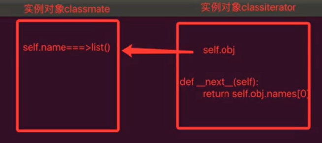

Status: published
Date: 2020-06-11 12:19:28
Author: Jerry Su
Slug: Iterator
Title: Iterator
Category: 
Tags: Python

[TOC]

### Iterator



iter(): 接收的是可迭代对象，返回的是迭代器。

next(): 接收的是迭代器，调用的是迭代器对象中的next函数，返回数据元素。

由于生成器是一种特殊的迭代器，故而用next()而不是iter()。

```python
class Classmate(object):
    def __init__(self):
        self.names = list()

    def add(self, name):
        self.names.append(name)

    def __iter__(self):
        # 返回迭代器对象
        return ClassIterator(self)

class ClassIterator(object):
    def __init__(self, obj):
        self.obj = obj
        self.cur = 0

    # 包含__iter__的方法对象成可迭代iterable
    def __iter__(self):
        pass

    # 包含__next__的方法对象成迭代器iterator
    def __next__(self):
        if self.cur < len(self.obj.names):
            res = self.obj.names[self.cur]
            self.cur += 1
            return res
        else:
            raise StopIteration
```

**优化：去除迭代器ClassIterator，将Classmate写成迭代器，返回自身self即可。**
```python
from collections import Iterable
import time

class Classmate(object):
    def __init__(self):
        self.names = list()
        self.cur = 0

    def add(self, name):
        self.names.append(name)

    def __iter__(self):
        return self

    def __next__(self):
        if self.cur < len(self.names):
            res = self.names[self.cur]
            self.cur += 1
            return res
        else:
            raise StopIteration


if __name__ == '__main__':
    classmate = Classmate()
    classmate.add('Jerry')
    classmate.add('Annie')
    classmate.add('Sophie')
    print('Iterable: {}'.format(isinstance(classmate, Iterable)))

    for temp in classmate:
        print(temp)
        time.sleep(1)
```

**Fibonacci数列，迭代器定义生成数据的方法，在访问的时候产生数据，节省内存。**
```python
class Fibonacci(object):
    def __init__(self, num):
        self.num = num
        self.cur = 0
        self.a = 0
        self.b = 1

    def __iter__(self):
        return self

    def __next__(self):
        if self.cur < self.num:
            res = self.a
            self.a, self.b = self.b, self.a + self.b
            self.cur += 1
            return res
        else:
            raise StopIteration


if __name__ == '__main__':
    fibo = Fibonacci(10)
    for num in fibo:
        print(num)
```

### Generator

生成器是特殊的迭代器。含有yield关键字的函数，不再是函数而是生成器。调用时不再是函数调用而是创建生成器对象。

yield关键字，将函数暂停，当下次访问时，接着yield后面继续执行。

生成器两种启动方式：next(generator)和generator.send()，后者可以传参。

生成器传参：generator.send('pass args')

生成器return：在迭代结束抛出异常StopIterator时，返回return的内容。

```python
def generator(n):
    cur = 0
    a, b = 0, 1
    while cur < n:
        ret = yield a
        print('ret>>>', ret)
        a, b = b, a + b
        cur += 1

# 并非调用函数，而是创建生成器对象，使用next()函数执行生成器代码。
obj = generator(10)

# next()函数传递的是迭代器，而生成器是一种特殊的迭代器
ret = next(obj)
print(ret)

# 启动生成器时，参数传给yield右边ret
ret = obj.send('pass arg')
print(ret)

ret = next(obj)
print(ret)
```

**结论**：迭代器能节省内存空间，能实现循环；生成器能暂定类函数的运行，用send或者next继续执行。他们都是保存生成数据的代码。

生成器的另一个重要应用协程：实现多任务。

```python
import time

def task1():
    while True:
        print('---1---')
        time.sleep(0.1)
        yield

def task2():
    while True:
        print('---2---')
        time.sleep(0.1)
        yield

def main():
    t1 = task1()
    t2 = task2()
    while True:
        next(t1)
        next(t2)

if __name__ == '__main__':
    main()
```

### Coroutine
采用同步的方式编写异步代码，线程的切换是操作系统执行的。单线程内的协程是程序员自己调度切换的。不需要锁的机制，函数的切换资源消耗更少，并发性更高。

协程：可以暂停的函数（生成器），且可以向暂停处传参。python通过生成器实现协程。