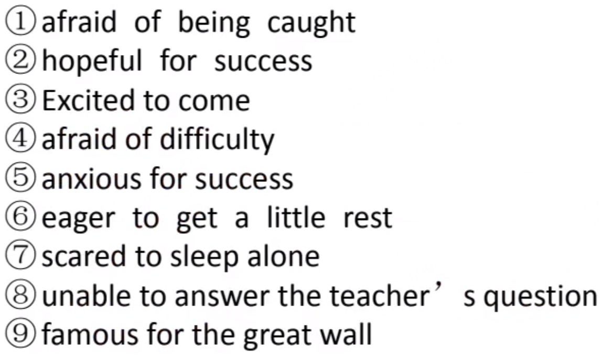

Status: published
Date: 2018-11-07 09:22:57
Author: Jerry Su
Slug: Grammar
Title: Grammar
Category: English
Tags: English

[TOC]

## 形容词短语

**adj + 介词短语 / to do / enough**

## 定语
前4后7

## 非谓语动词短语零件
- 零件9: **`to + v`**（宾语）定式短语 
- 零件10：**`v-ing`** (宾语）定式短语
- 零件11: **`v-ed`** （宾语）定式短语

1. `to + v`与`v-ing`:一般做主、宾、定、状、补、表

2. `v-ed`:多做定语

3. `to + v`与`v-ing`区别：`to + v`倾向于将来或临时性动作；`v-ing`倾向于长期性、习惯性、计划性动作。

4. 注意: 非谓语动词其实也是可以撑当谓语的，但是前面必须加上助动词。

`He is to tell you.`

`I am reading a book.`

`I am pushed by him.`

**非谓语动词名称改正:**

`to + v` : 传统语法称作`动词不定式`。`不定`=`infinite`原意是`不受主语、时态等外界因素影响而保持不变`。应翻译为`不变式`或`定式`。改名为**`to + v定式短语`**因为外形固定。

`v + ing` : 传统语法称作`现在分词`或`动名词`。`v + ing`不一定发生在现在，可以在过去、现在和将来的任何时间。改名为**`v + ing定式短语`**。  

`v + ed` : 传统语法称作`过去分词`同样欠妥。`v + ed`也可以发生在现在和将来。改名为**`v + ed定式短语`**
